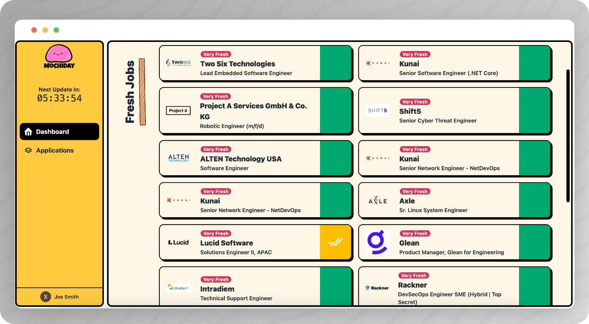
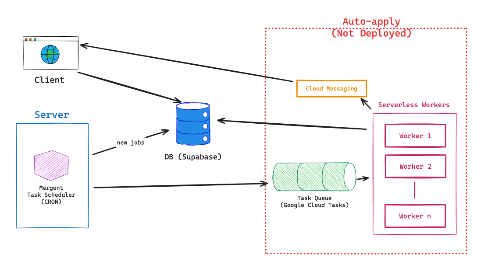

---

  <i>Fresh SWE jobs before they made it to LinkedIn.</i>

  
  
  
  

  <a href="https://mochiday.co/">Home</a>

## 👻 Features

- **⚡️ Always Fresh**: jobs are fetched in frequently intervals

- **✅ Easy Process**: we fetch jobs solely from friendly ATSs

- **🍼 Auto Tracking**: applied jobs are automatically saved

  

## 🚀 Getting Started

### MochiDay.Co

Start applying for jobs at [MochiDay.Co](https://mochiday.co/). No
sign-up required except for saving application progresses.

### Self-Host

See the TODO: [setup guide]() to develop & deploy MochiDay yourself.

## 📐 Architecture

Below is a simple diagram of MochiDay's architecture. We have
implemented the auto-apply bot that works locally but will get Captcha'd
if deployed on a server.

  

